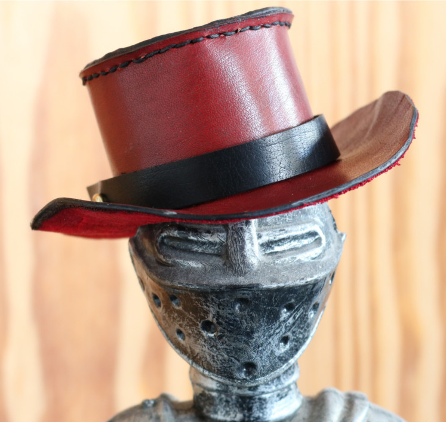

---
---

<link rel="stylesheet" href="styles.css" type="text/css">

## Steven R. Talbot
### Data Scientist

I like data. I really do!  

Solving the mysteries of hidden knowledge in heaps of data have become my passion the very moment I have initiated myself into Machine Learning during my dissertation over 13 years ago. 

Currently I'm working as a **Data Scientist** at the Institute for [Laboratory Animal Science](https://www.mh-hannover.de/index.php?id=219&L=1) at the [Hannover Medical School (Germany)](https://www.mh-hannover.de/index.php?&L=1). My focus lies on the development of mathematical models for [severity assessment in laboratory animals](https://severity-assessment.de/) as well as in contributing to the 3R principle via the [R2N](https://r2n.eu/) network with my computational expertise.  

I graduated from the [Leibniz University of Hannover (Germany)](https://www.uni-hannover.de/en/) with a Diploma in Biochemistry in 2006. Until 2009, I continued working on pathogen detection at the Bundeswehr Research Institute for Protective Technologies and CBRN Protection ( [WIS](https://www.baainbw.de/portal/a/baain/start/diensts/wis/!ut/p/z1/hY7LCsIwFET_qBMifbhs0aJQYrFSTTZyqSFWYlIkFD_fiOvi7ObBYaBwgXI0j4bC6B3Z6KXKrlXRnBq-5nzTbjnbr3Z9eqwOjIkcPc7_JirWbEElQ6cdZGTki4w6QwcF9aCZ3snkX8HqkNDw_Qh5J3ezuvVD-Qvi0BrISJ2edSFEaj4MClyI/dz/d5/L2dBISEvZ0FBIS9nQSEh/#Z7_B8LTL2922DPE20I3HV5RBO00F6) ) where I developed multivariate methods for spectroscopic analyses under the advisement of [Prof. Thomas Scheper](https://www.tci.uni-hannover.de/scheper.html) for my dissertation. Since 2009 I'm also working as a freelancing data science/statistics consultant and re-joined the Hannover Medical School and Prof. André Bleich in 2017 to work on my habilitation. Also, I’m the author of the statistics and experimental design sections of the current [Pschyrembel 2018](https://www.pschyrembel.de/).

Oh...and of course I'm an avid R-enthusiast,... I also love cycling... and pizza.

