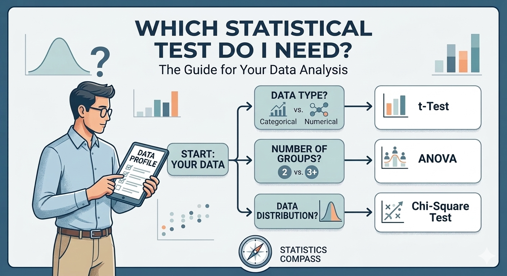

## The Question That Haunts Every Researcher

You have collected your data. The experiment went well. The spreadsheet is clean and organized. You open your statistics software, and then it hits you: *Which test am I supposed to use?*

This moment of uncertainty is remarkably universal. It strikes first-year students staring at their bachelor thesis data. It strikes postdocs who have not run a statistical analysis since their PhD. It even strikes experienced researchers venturing into unfamiliar experimental designs. The sheer number of available statistical tests, each with its own assumptions, requirements, and quirks, can feel paralyzing.

And the stakes are real. Choose the wrong test, and your results may be meaningless. Use a parametric test on data that violate its assumptions, and your p-value is fiction. Apply a test designed for independent groups to paired observations, and your conclusions collapse. Reviewers will notice. They always notice.

## The Textbook Problem

Statistics textbooks exist, of course. Hundreds of them. But they tend to share a common flaw: they are organized by test, not by question. Chapter 7 covers the t-test. Chapter 12 explains ANOVA. Chapter 15 introduces non-parametric alternatives. This structure is logical from a mathematical perspective, but it is backwards from a researcher's perspective.

A researcher does not wake up thinking, "I would like to perform a Mann-Whitney U test today." A researcher thinks, "I have two groups of animals, the data look skewed, and I want to know if the treatment made a difference." The gap between these two starting points is where most people get lost.

Decision flowcharts printed in textbooks help, but they are static. You trace your finger along branches, second-guessing yourself at each fork. *Is my data really normally distributed? Does "more than two groups" mean I need ANOVA even if I only care about two of them?* By the time you reach the endpoint, you have lost confidence in half the decisions you made along the way.

## A Guided Path Through the Jungle

**PickMyTest** was built to close this gap. Instead of presenting a catalog of tests and hoping you find the right one, it asks you simple questions about your data and your research question, then tells you which test fits.

The idea is straightforward: describe what you have and what you want to know, and let the tool do the matching. Think of it as a diagnostic assistant for your analysis. You do not need to know what a Kruskal-Wallis test is before you start. You just need to know basic things about your own experiment: How many groups do you have? Are your measurements independent or paired? Is your outcome a number or a category?

Three steps, and you arrive at a recommendation, complete with an explanation of how the test works, what assumptions it makes, and how to interpret the results.

## Why This Matters More Than You Think

The consequences of choosing the wrong statistical test extend far beyond a single analysis. They ripple through the entire scientific process.

**Wasted resources.** An experiment analyzed with an inappropriate test may yield inconclusive results, not because the biology failed, but because the statistics did. Animals were used, time was spent, and funding was consumed, all for a result that cannot be trusted. In animal research, where every experiment carries an ethical cost, this is not merely inefficient. It is irresponsible.

**Irreproducible findings.** The replication crisis in biomedical research has many causes, but flawed statistical analyses are among the most preventable. When researchers pick tests based on what their labmate used last year rather than what the data require, they introduce systematic errors that erode scientific credibility.

**Gatekeeping.** Statistics anxiety is a real barrier, particularly for students and early-career researchers. The fear of "doing it wrong" can delay analyses, prevent publication, and even discourage talented people from pursuing research careers. Making the test selection process more accessible is not dumbing things down. It is removing an unnecessary obstacle.

## What PickMyTest Covers

The tool currently includes 17 statistical tests spanning the most common scenarios in empirical research:

**Comparing groups** with parametric tests like the t-test and ANOVA, or their non-parametric counterparts like the Mann-Whitney U test, the Wilcoxon signed-rank test, the Kruskal-Wallis test, and the Friedman test. Whether you have two groups or many, independent samples or repeated measures, there is a path to the right answer.

**Examining relationships** through Pearson and Spearman correlations, linear regression, and logistic regression for binary outcomes.

**Analyzing categorical data** with chi-square tests, Fisher's exact test, and McNemar's test for paired nominal data.

This is not an exhaustive encyclopedia of statistics. It deliberately is not. Covering every conceivable test would recreate the very problem the tool aims to solve: overwhelming users with options. Instead, PickMyTest focuses on the tests that the vast majority of students and researchers actually need. The 17 tests that handle perhaps 90% of real-world analysis situations.

## Not a Replacement, but a Starting Point

It is worth being clear about what PickMyTest is and what it is not. It is not a substitute for statistical training. It will not rescue a fundamentally flawed experimental design. And for complex analyses involving nested factors, mixed models, or Bayesian frameworks, you will still need to consult a statistician or a specialized textbook.

What it does, and does well, is answer the first question: "Where do I even start?" Once you know that your situation calls for, say, a paired t-test or a Friedman test, you can look up the details with confidence. You have a direction. The paralysis is broken.

For students in particular, this guided approach can be genuinely educational. Rather than memorizing a table of tests, they learn to think about their data in terms of the properties that matter: scale of measurement, independence of observations, number of groups, distributional assumptions. These are the concepts that build lasting statistical intuition.

## Try It Yourself

PickMyTest is freely available in both English and German. No registration, no installation, no paywall. Just your data questions and a few clicks.

Give it a try the next time you find yourself staring at a dataset, wondering where to begin. And if it helps, share it with your students, your colleagues, or that friend who has been avoiding their thesis analysis for three weeks.

---

**Explore PickMyTest:**

- [PickMyTest — Find the Right Statistical Test](https://pickmytest.talbotsr.com/en)
